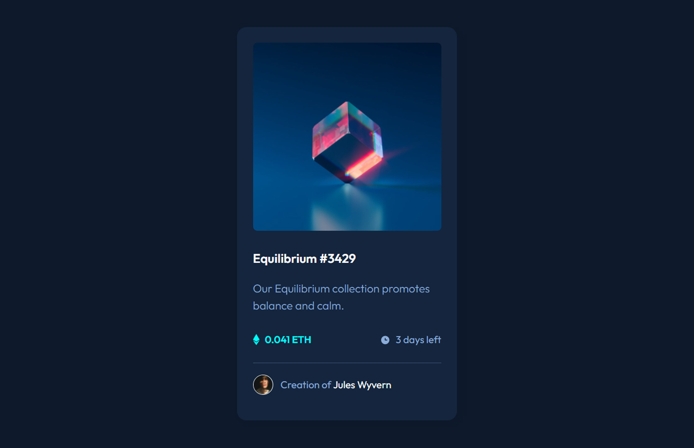

# Frontend Mentor - Order summary card solution

This is a solution to the [NFT preview card component challenge on Frontend Mentor](https://www.frontendmentor.io/challenges/nft-preview-card-component-SbdUL_w0U). Frontend Mentor challenges help you improve your coding skills by building realistic projects. 

## Table of contents

- [Overview](#overview)
  - [The challenge](#the-challenge)
  - [Screenshot](#screenshot)
  - [Links](#links)
- [My process](#my-process)
  - [Built with](#built-with)
  - [What I learned](#what-i-learned)
  - [Useful resources](#useful-resources)
- [Author](#author)

## Overview

### The challenge

Users should be able to:

- See hover states for interactive elements

### Screenshot

### Links

- Solution URL: [Frontend Mentor Solution](https://www.frontendmentor.io/solutions/nft-preview-card-componente-pure-html-css-ryoB5ePU5)
- Live Site URL: [Live Site at Vercel](https://nft-preview-card-livid-rho.vercel.app/)

## My process

### Built with

- Semantic HTML5 markup
- CSS custom properties
- Flexbox
- Responsive Design

### What I learned

I learned how to create hover states on an image inside a container with an svg icon output, It took some time to understand how to wrap the main div for the image and manage the css to display the hidden image with its transitions and transformation. I'm happy with the result. 

- I added custom hover state on h1, price section and creator section, using a spinning color animation and transform(rotate) on icons.

I did a lots of research to achieve it, but a tutorial from youtube helped me. Link: https://www.youtube.com/watch?v=exb2ab72Xhs&t=591s

### Useful resources

- [CSS filter generator to convert from black to target hex color](https://codepen.io/sosuke/pen/Pjoqqp) - This website helped me to calculate the color filter to use as a hover state for some SVG elements.
- 
- [Image Hover Text Overlay Effect with HTML & CSS - Web Design Tutorial](https://www.youtube.com/watch?v=exb2ab72Xhs&t=591s) - Explains how to set up the HTML and CSS file for the hover effect.

- [Multicolor hover effect](https://codepen.io/divinector/pen/JVVJYY) - Code pen for multiple colors on hover

## Author
- Github - [correlucas](https://github.com/correlucas/order-summary-component)
- Frontend Mentor - [@correlucas](https://www.frontendmentor.io/profile/yourusername)

